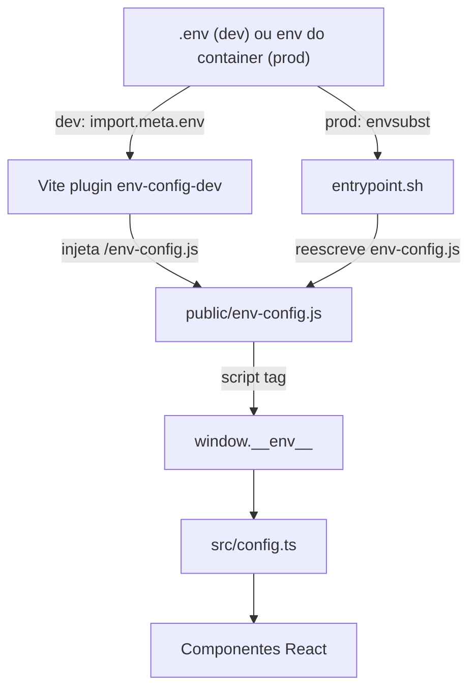

# Ambiente — variáveis, deploy, segurança

## Variáveis de ambiente

Definidas como `VITE_*` no `.env` (template em `.env.example`):

| Variável | Uso | Default |
|----------|-----|---------|
| `VITE_SUPABASE_URL` | URL do Supabase | — |
| `VITE_SUPABASE_ANON_KEY` | chave anônima (uso em login etc.) | — |
| `VITE_SUPABASE_SERVICE_KEY` | service key (queries internas) | — |
| `VITE_KOMMO_TOKEN` | Bearer token para Kommo API | — |
| `VITE_KOMMO_SUBDOMAIN` | subdomínio Kommo | `academicosoead` |

No frontend, usar via [`src/config.ts`](../src/config.ts):

```ts
import { env } from './config';
console.log(env.SUPABASE_URL); // janela ou import.meta.env
```

## Como as variáveis chegam ao browser



## Dev local

1. Crie `.env` na raiz copiando `.env.example`
2. Preencha as 3 chaves Supabase + token Kommo
3. `npm install`
4. `npm run dev`

O plugin `env-config-dev` (em [`vite.config.ts`](../vite.config.ts)) intercepta requisições a `/env-config.js` e devolve `window.__env__ = {...}` em runtime.

## Deploy Docker

[`Dockerfile`](../Dockerfile) faz build em stage `node:20-alpine` e serve com `nginx:alpine`.

Variáveis devem ser passadas no `docker run` / docker-compose:

```bash
docker run -p 80:80 \
  -e VITE_SUPABASE_URL=https://... \
  -e VITE_SUPABASE_ANON_KEY=... \
  -e VITE_SUPABASE_SERVICE_KEY=... \
  -e VITE_KOMMO_TOKEN=... \
  -e VITE_KOMMO_SUBDOMAIN=academicosoead \
  dashboard-bu
```

`entrypoint.sh` (gerado inline no Dockerfile):
1. Reescreve `/usr/share/nginx/html/env-config.js` com as variáveis recebidas
2. Roda `envsubst` em `nginx.conf.template` → `conf.d/default.conf` (substitui `${KOMMO_SUBDOMAIN}`)
3. Inicia nginx em foreground

## Sessões Google (anh_google_sessions)

A tabela `anh_google_sessions` é consumida diretamente via PostgREST por
[`src/services/sessionsService.ts`](../src/services/sessionsService.ts) (filtros
`created_at=gte/lte`, paginação por `limit/offset` de 1000 linhas). Não há mais
backend Express dedicado — o antigo `api-server.js` foi removido.

## Scripts Python

Tokens hardcoded em:
- [`preencher_polo_sumaganhos.py`](../preencher_polo_sumaganhos.py)
- [`gerar_planilha_ganhos.py`](../gerar_planilha_ganhos.py)

São de uso interno/local, mas idealmente migrar para `os.environ.get()`.

## Segurança — débito técnico conhecido

| Onde | Tipo | Risco |
|------|------|-------|
| `preencher_polo_sumaganhos.py` | service_key Supabase + token Kommo | Alto |
| `gerar_planilha_ganhos.py` | service_key Supabase | Alto |
| `nginx.conf` (versionado) | subdomínio fixado | Baixo |

**Recomendações:**
1. Mover tokens para `.env` e adicionar `.env*` ao `.gitignore` (verificar se já está)
2. Rotacionar credenciais que já foram comitadas no histórico
3. Usar `.env.local` para dev individual

## Arquivos relacionados

- [`.env.example`](../.env.example) — template
- [`vite.config.ts`](../vite.config.ts) — plugin `env-config-dev` + proxy
- [`src/config.ts`](../src/config.ts) — leitura de `window.__env__` e `import.meta.env`
- [`public/env-config.js`](../public/env-config.js) — placeholder em dev
- [`entrypoint.sh`](../entrypoint.sh) — geração runtime no Docker
- [`Dockerfile`](../Dockerfile) — build + entrypoint inline
- [`nginx.conf.template`](../nginx.conf.template) — template do proxy `/kommo-api`
