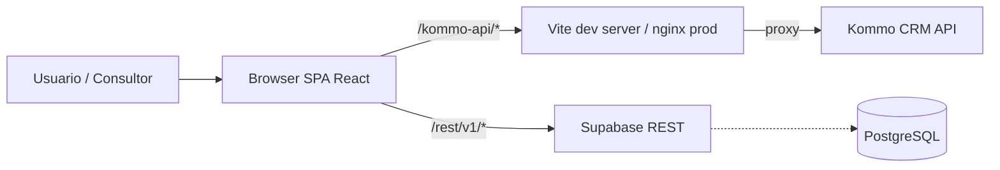

# Arquitetura

## Visão geral



## Camadas

| Camada | Tecnologia | Função |
|--------|-----------|--------|
| SPA | React 18 + Vite + TS + Tailwind | Painéis, autenticação, admin |
| HTML legacy | `public/dashboard_consultores.html` | Dashboard standalone do consultor (entra via iframe) |
| Proxy CRM | Vite (dev) / nginx (prod) | Resolve `/kommo-api/*` → Kommo (evita CORS) |
| Backend | Supabase | Autenticação custom, persistência, views, sessões Google |
| CRM | Kommo | Leads, contatos, custom fields, pipelines |

## Páginas (`src/pages/`)

| Arquivo | Rota | Propósito | Acesso |
|--------|------|-----------|--------|
| `LoginPage.tsx` | `/login` | Login (tabela `Senhas Dash`). Layout split com painel de branding + formulário com dropdown customizado de consultor | Público |
| `LeadsDashboard.tsx` | `/` | Wrapper que abre `dashboard_consultores.html` em iframe com credenciais | Todos |
| `SumareDashboard.tsx` | `/sumare` | Dashboard por bandeira Sumaré | Admin |
| `AnhangueraDashboard.tsx` | `/anhanguera` | Dashboard por bandeira Anhanguera | Admin |
| `LeadsParadosPage.tsx` | `/leads-parados` | Lista leads parados via Kommo | Admin |
| `FormatarPlanilhaPage.tsx` | `/formatar-planilha` | Importa planilha → cria/atualiza leads no Kommo | Admin |
| `MetaPage.tsx` | `/meta` | Admin: edita tabela `Meta_ANH` (metas e prêmios) | Admin |
| `MetaCampanhas.tsx` | `/meta-campanhas` | Métricas de campanhas Meta Ads (webhook n8n). Visual padronizado com o restante do dashboard | Admin |
| `MuralAvisosPage.tsx` | `/mural-avisos` | Exibe avisos para consultores; admin cria/edita/exclui. Confirmações salvas em `confirmacoes_avisos` | Todos |
| `CalendarioAcademicoPage.tsx` | `/calendario-academico` | Eventos acadêmicos com CRUD para admin (`eventos_academicos`) | Todos |
| `AcademicoDashboardPage.tsx` | `/academico` | KPIs acadêmicos (`vw_academico_*`) | Admin |
| `AcademicoColaboradoresPage.tsx` | `/academico/colaboradores` | Distribuição/TMA (`vw_historico_distribuicao`) | Admin |
| `BlogAdminPage.tsx` / `BlogCreatePage.tsx` | `/blog-controle` | CRUD blog (`blog_posts`) | Admin |
| `SessionsDashboard.tsx` | `/sessoes` | Sessões Google (lê `anh_google_sessions` direto via PostgREST) | Admin |
| `TemplatesHub.tsx` | `/templates-hub` | Templates compartilhados + sugestões | Todos |

## Componentes notáveis

- **`src/components/Sidebar.tsx`** — navegação lateral com seções colapsáveis em cascata, largura 288 px, indicador de rota ativa com borda colorida. Contador de sugestões pendentes com polling 15 s. Modo Comercial / Acadêmico.
- **`src/components/Layout.tsx`** — layout principal: renderiza `<MetaCountdown>` (topo do conteúdo) e `<AvisoPopup>` (popup flutuante). Sidebar desliza via `translateX` com largura `SIDEBAR_W = 288`.
- **`src/components/AvisoPopup.tsx`** — exibe avisos não confirmados em popup sequencial para consultores. Estado de "ler depois" em `useState` (limpo a cada login). Confirma via tabela `confirmacoes_avisos`.
- **`src/components/MetaCountdown.tsx`** — barra fixa no topo do conteúdo mostrando progresso de leads ganhos vs meta e countdown para o fim do período. Busca dados de `Meta_ANH` e `sum_leads_ganhos` / `anh_leads_ganhos`.
- **`src/components/Skeleton.tsx`** — componentes reutilizáveis de skeleton loading: `SkeletonBox`, `SkeletonText`, `SkeletonStat`, `SkeletonCardList`, `SkeletonTableRows`.
- **`src/contexts/AuthContext.tsx`** — auth contra `Senhas Dash`
- **`src/templates/`** — sistema de templates (`Templates`, `Template_Sugestoes`)
- **`src/services/`**:
  - `blogService.ts` — CRUD `blog_posts`
  - `leadsParadosService.ts` — leads via Kommo
  - `sessionsService.ts` — lê `anh_google_sessions` via Supabase REST
  - `avisosService.ts` — CRUD `avisos` + gerenciamento de `confirmacoes_avisos`
  - `calendarioService.ts` — CRUD `eventos_academicos`

## Estilos globais (`src/index.css`)

Além das diretivas Tailwind, o arquivo define:

- **Scrollbar temática global** (`::-webkit-scrollbar` + `scrollbar-width`/`scrollbar-color` para Firefox): thumb branco com 10 % de opacidade, 4 px de largura, track transparente — combina com o fundo escuro do dashboard.

## Scripts standalone

Detalhes em [scripts.md](scripts.md):

- `preencher_polo_sumaganhos.py` — sync Polo: Kommo → `sum_leads_ganhos`
- `gerar_planilha_ganhos.py` — exporta planilha estilizada de ganhos
- `gerar-planilha-base.mjs` — gera template Excel para Kommo
- `verificar-planilha.mjs` — valida planilha antes de importar
- `debug-data.mjs` — testa conversão de datas

## Fluxos principais

### 1. Login do consultor

```
LoginPage → AuthContext → Supabase /rest/v1/Senhas%20Dash → JWT custom em sessionStorage
```

### 2. Dashboard do consultor (HTML legacy)

```
LeadsDashboard.tsx → iframe ?sbUrl=&sbAnon=&sbService= 
  → dashboard_consultores.html
  → Webhook n8n + Supabase (Meta_ANH, sum_leads_ganhos, vw_primeira_atribuicao)
  → Kommo /users (cache)
```

### 3. Importar planilha

```
FormatarPlanilhaPage.tsx
  → lê xlsx
  → /kommo-api/api/v4/contacts (POST)
  → /kommo-api/api/v4/leads (POST/PATCH)
  → escreve resultados no Supabase
```
