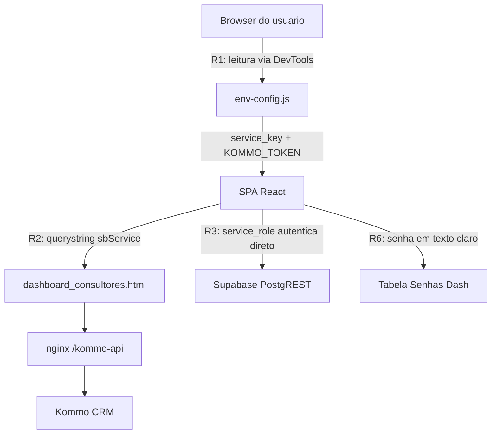

# Segurança — Riscos, Mitigações e Status

Relatório consolidado de segurança do projeto. Atualizar a coluna **Status** sempre que mitigar um item.

## Resumo executivo



## Catálogo de riscos

Legenda: **Severidade** P0 (crítico) → P3 (boa prática). **Status** Aberto / Mitigado em código / Mitigado / N/A.

### P0 — Críticos (exposição imediata)

| ID | Risco | Arquivo | Vetor | Mitigação | Status |
|----|-------|---------|-------|-----------|--------|
| R1 | `service_role` Supabase exposto no browser | [src/config.ts](../src/config.ts) | Qualquer usuário do sistema abre DevTools, pega `window.__env__.SUPABASE_SERVICE_KEY` e ganha bypass total de RLS | Frontend usa apenas `anon_key`. `service_role` só em backend. Migrar para Supabase Auth nativo | **Aberto** |
| R2 | Senhas em texto claro no banco | [src/contexts/AuthContext.tsx](../src/contexts/AuthContext.tsx) | `?Senha=eq.${password}` revela que `Senhas Dash.Senha` é plain text. Quem tem service_key (R1) lê tudo | Migrar para Supabase Auth (hash automático bcrypt) | **Aberto** |
| R3 | Credenciais Postgres versionadas no Git | (histórico) | Senha `^&TN5Qkg3BTXpW#eeqHj@E` ainda existe em commits antigos (era usada pelo extinto `api-server.js`). Qualquer clone do repo tem | 1) ~~Mover para `process.env`~~ ✓ código removido. 2) **Rotacionar a senha no Postgres** (ainda pendente). 3) Limpar histórico (BFG/git-filter-repo) | **Código removido** (`api-server.js` deletado) — falta R3.2 e R3.3 |
| R4 | Querystring com chaves no HTML legacy | [src/pages/LeadsDashboard.tsx](../src/pages/LeadsDashboard.tsx) | `?sbService=...` na URL fica em logs nginx, histórico do navegador, headers Referer | Trocar por `postMessage` para o iframe. Depende de R1 (anon_key) | **Aberto** |
| R5 | Tokens hardcoded em scripts Python | [preencher_polo_sumaganhos.py](../preencher_polo_sumaganhos.py), [gerar_planilha_ganhos.py](../gerar_planilha_ganhos.py) | `service_key` Supabase + `KOMMO_TOKEN` em texto claro nos arquivos | Ler de `os.environ.get()`. Adicionar ao `.gitignore` se aparecer outro com creds | **Mitigado em código** — falta rotacionar tokens |

### P1 — Altos

| ID | Risco | Arquivo | Vetor | Mitigação | Status |
|----|-------|---------|-------|-----------|--------|
| R6 | Sem RLS no Supabase | (Supabase) | Sem políticas por linha; consultor X pode ler dados de Y se tiver service_key | Habilitar RLS em todas tabelas. Políticas: `consultor = auth.jwt() ->> 'name'` | **Aberto — requer SQL no Supabase** |
| R7 | api-server.js sem CORS, auth, rate limit | — | Endpoint público `/api/sessions/list` baixava todas sessões sem autenticação | `api-server.js` removido — sessões agora vêm via PostgREST (`anh_google_sessions`) com `service_role` que **ainda é P0/R1**. RLS resolve definitivamente | **N/A** (superfície removida) — risco residual coberto por R1/R6 |
| R8 | Nginx sem headers de segurança | [nginx.conf.template](../nginx.conf.template) | Falta CSP, X-Frame-Options, X-CTO, HSTS, Referrer-Policy → permite clickjacking, MIME sniffing, downgrade | Adicionar `add_header` para os 5 headers principais | **Mitigado em código** |
| R9 | Sem HTTPS no nginx | [nginx.conf.template](../nginx.conf.template) | `listen 80` apenas. Se não há proxy reverso TLS upstream, todo tráfego (incluindo `Authorization`) trafega em claro | Confirmar terminação TLS upstream. Se não houver, `listen 443 ssl` + redirect 80→443 | **Documentado** (depende do ambiente) |
| R10 | SPA sem CSRF token | toda app | Se usar cookies de sessão, qualquer site pode forjar requisições. Hoje usa Bearer token em `apikey`/`Authorization` headers, mitigado parcialmente | Manter Bearer (não cookies) ou implementar `SameSite=Strict`+CSRF | **Aceito** (Bearer-based, baixo risco) |

### P2 — Médios

| ID | Risco | Arquivo | Vetor | Mitigação | Status |
|----|-------|---------|-------|-----------|--------|
| R11 | `supa_openapi.json` untracked + logs | raiz | Schema Supabase completo + logs com PII (id_lead, polo, consultor) podem ser commitados acidentalmente | `.gitignore` blocando `supa_openapi.json`, `log_*.txt`, `*.xlsx`, `.env*` | **Mitigado em código** |
| R12 | Log com PII | [log_polo_sumaganhos.txt](../log_polo_sumaganhos.txt) | Já existe localmente | Coberto pelo R11 + rotação periódica | **Mitigado em código** |
| R13 | Sem audit log de admin | (Supabase `Meta_ANH`) | Mudanças em metas/prêmios não registram quem alterou nem quando | Trigger Postgres em `Meta_ANH` populando `Meta_ANH_audit` | **Documentado — requer SQL no Supabase** |
| R14 | sessionStorage para auth | [src/contexts/AuthContext.tsx](../src/contexts/AuthContext.tsx) | Logout só local. Sessão não pode ser invalidada server-side | Migrar para Supabase Auth (refresh tokens) | **Aberto — coberto pelo R1** |
| R15 | Sem auditoria de dependências | CI | npm/pip podem ter CVEs não detectadas | GitHub Action com `npm audit --audit-level=high` em PRs | **Mitigado em código** |
| R16 | Sem 2FA no admin | (Supabase) | Admin compromete tudo com 1 senha | Habilitar TOTP em Supabase Auth quando R1 for feito | **Aberto — coberto pelo R1** |

### P3 — Boas práticas

| ID | Risco | Arquivo | Vetor | Mitigação | Status |
|----|-------|---------|-------|-----------|--------|
| R17 | Sem secrets scanning | CI | Tokens novos podem ser comitados sem aviso | GitHub Action com [gitleaks](https://github.com/gitleaks/gitleaks) | **Mitigado em código** |
| R18 | Rotação de tokens | operacional | Tokens vivem indefinidamente | Política trimestral. Procedimento abaixo | **Documentado** |
| R19 | SRI em scripts externos | `index.html` | Script externo comprometido executa código | Adicionar `integrity="sha384-..."` em CDN scripts (não há CDN scripts hoje, **N/A**) | **N/A** |
| R20 | Lockfile Python | scripts | `openpyxl` instalado solto | Migrar para `requirements.txt` ou `uv` | **Aberto** |

## Procedimento de rotação trimestral (R18)

A cada 3 meses:

1. **Postgres** (host `147.93.34.2`, ainda em uso por automações fora deste repo):
   - `ALTER USER postgres WITH PASSWORD '<nova>'`
2. **Supabase**:
   - Dashboard → Settings → API → Reset `service_role` key
   - Atualizar `VITE_SUPABASE_SERVICE_KEY` (e `SUPABASE_SERVICE_KEY` em scripts)
   - **Não** rotacionar `anon_key` sem coordenação (afeta usuários logados)
3. **Kommo**:
   - Account → Integrations → reemitir token
   - Atualizar `VITE_KOMMO_TOKEN` e `KOMMO_TOKEN`
4. Após rotação, garantir que `gitleaks` (R17) não detecta vazamento.

## Migração de autenticação (R1 + R2 + R6 + R14 + R16)

Guia completo passo-a-passo: [migracao-auth.md](migracao-auth.md).

Resumo:

### Lado Supabase (manual via dashboard/SQL)

1. Criar usuários em `auth.users` correspondentes a cada linha de `Senhas Dash`. Senhas precisam ser **redefinidas** (não há como recuperar plaintext de uma migração segura).
2. Criar tabela `consultor_profile (user_id uuid references auth.users, nome text, role text)`.
3. Habilitar RLS:
   ```sql
   ALTER TABLE sum_leads_ganhos ENABLE ROW LEVEL SECURITY;
   CREATE POLICY "consultor_le_proprios" ON sum_leads_ganhos
     FOR SELECT USING (
       consultor = (SELECT nome FROM consultor_profile WHERE user_id = auth.uid())
       OR EXISTS (SELECT 1 FROM consultor_profile WHERE user_id = auth.uid() AND role = 'admin')
     );
   ```
   Repetir para `anh_leads_ganhos`, `Meta_ANH`, etc.
4. Habilitar 2FA (R16) em Settings → Authentication → MFA.

### Lado código (preparado, aguardando ativação)

- `AuthContext.tsx` passa a usar `supabase.auth.signInWithPassword(...)`
- `src/config.ts` deixa de expor `SUPABASE_SERVICE_KEY` no browser
- `LeadsDashboard.tsx` envia apenas `anon_key` ao iframe via `postMessage`
- `dashboard_consultores.html` lê `anon_key` via postMessage e usa em vez de `service_role`

## Limpeza do histórico Git (R3.3)

A senha Postgres está em commits antigos. Mesmo trocando a senha agora, qualquer fork/clone antigo ainda tem. Procedimento:

```bash
git clone --bare <repo> repo-clean.git
cd repo-clean.git
bfg --replace-text passwords.txt   # passwords.txt = padrões a substituir
git reflog expire --expire=now --all && git gc --prune=now --aggressive
git push --force
```

**Coordenar com a equipe** antes de fazer force-push.

## Como contribuir

Se identificar novo risco, adicione linha na tabela apropriada com:
- ID novo (R21+)
- Arquivo afetado com markdown link
- Vetor concreto (não genérico)
- Mitigação proposta
- Status inicial: `Aberto`
